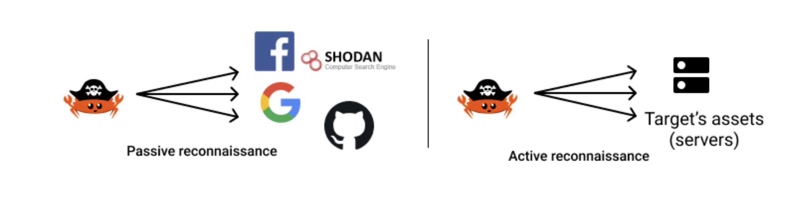

# LazyRecon Overview

This Rust project is a multi-threaded scanner designed for efficient attack surface discovery. It automates the process of finding subdomains and scanning their common TCP ports, helping security professionals quickly map out potential entry points.

This project draws inspiration from the book [Black Hat Rust](https://kerkour.com/black-hat-rust) by [Sylvain Kerkour](https://kerkour.com/), which explores offensive security techniques and tooling using the Rust programming language.

## Key Components

- **Subdomain Enumerator:** Discovers subdomains for a given target domain using a wordlist and DNS resolution.
- **Port Scanner:** For each discovered subdomain, scans a set of common TCP ports to identify open services.
- **Multithreading:** Both subdomain enumeration and port scanning leverage Rust's threading capabilities for high performance and speed.

## Architecture

The scanner is organized into the following modules:

- `src/main.rs`: Entry point. Handles CLI argument parsing, configuration, and coordinates the overall workflow.
- `src/subdomains.rs`: Implements subdomain enumeration logic, including DNS resolution and crt.sh integration.
- `src/ports.rs`: Contains TCP port scanning logic for discovered subdomains.
- `src/common_ports.rs`: Defines the set of common ports to scan.
- `src/model.rs`: Data models for subdomains, ports, and crt.sh entries.
- `src/error.rs`: Custom error types and error handling utilities.

The workflow is as follows:

1. **Input:** The user provides a target domain.
2. **Subdomain Enumeration:** The tool spawns threads to resolve potential subdomains in parallel.
3. **Port Scanning:** For each valid subdomain, threads are spawned to scan the specified ports.
4. **Results:** Open ports and discovered subdomains are reported in real-time or return to the screen.

## How to Use

### Prerequisites

- [Rust toolchain](https://www.rust-lang.org/tools/install) installed

### Run

```sh
# RUN cargo run -- --help for these details

Usage: lazyrecon [OPTIONS] --target <TARGET>

Options:
  -t, --target <TARGET>  Target domain to scan
  -o, --output <FILE>    Save results to a file instead of printing to console
  -f, --format <FORMAT>  Output format: plain or json (default: plain)
  -h, --help             Print help
  -V, --version          Print version
```

```sh
# Print result in the console
cargo run -- -t github.com
# OR
cargo run -- --target github.com

# Scan and save result in a specified file
cargo run -- -t github.com -o result.txt

# Scan and save result in a specified JSON file
cargo run -- -t github.com -o result.json -f json
```

# What is Reconnaissance?

Reconnaissance, often referred to as "recon" is the initial phase of a security assessment or penetration test where information about a target system, network, or organization is collected.

The objective is to gather as much relevant data as possible—such as domain names, IP addresses, technologies in use, and potential vulnerabilities—without alerting the target. This intelligence forms the foundation for identifying possible attack vectors and planning further actions.

There are 2 ways to perform reconnaissance: **Passive** and **Active**



## Passive Reconnaissance

This is the process of gathering information about a target without interacting with it directly by using publicly available sources, also known as **OSINT** (Open Source INTelligence).

For example:

- Searching for information in public databases (WHOIS, DNS records)
- Reviewing social media profiles and posts
- Examining company websites and press releases
- Looking up leaked credentials or data breaches
- Gathering information from search engines (Google dorking)

### What Data is Collected During Passive Reconnaissance?

During passive reconnaissance, attackers or security professionals may collect:

- Domain names and subdomains
- IP addresses and network ranges
- WHOIS registration details
- DNS records (A, MX, TXT, etc.)
- Employee names, email addresses, and phone numbers
- Technology stacks and software versions
- Publicly available documents (PDFs, Word files, etc.)
- Social media activity and organizational structure
- Leaked credentials or sensitive data from breaches

Tools like [Shodan](https://www.shodan.io/) can be used to discover exposed servers, webcams, routers, and other devices, as well as to gather intelligence about a target's online infrastructure.

This information helps build a profile of the target without alerting them to the investigation.

## Active Reconnaissance

This is the process of gathering information about a target directly by interacting with it.

Active reconnaissance can be detected by firewalls, intrusion detection systems, or honeypots (a honeypot is an external endpoint that shall never be used by regular users, so the only user is hitting this endpoint are attackers, it can be a mail server, an HTTP server, or even a document with remote content embedded). To reduce the risk of detection, consider the following techniques:

- Limit the frequency and volume of requests to avoid triggering rate limits or alarms.
- Randomize request patterns and timing to mimic normal user behavior.
- Use proxy servers or VPNs to mask your source IP address.
- Rotate user-agent strings and other request headers.
- Avoid scanning sensitive or high-profile endpoints.
- Monitor for signs of detection, such as connection resets or blocks, and adjust your approach accordingly.

Careful planning and stealthy techniques can help minimize the chances of being detected during active reconnaissance.

# Reconnaissance Process

The reconnaissance of a target can be split into 2 steps:

1. Assets discovery
2. Vulnerability identification

## Assets Discovery

Traditionally, assets can be defined as technical elements such as: IP addresses, servers, domain names, networks, etc. Nowadays, the scope is broader and encompasses social network accounts, public source code repositories, IoT objects, etc. Basically, everything is on or connected to the internet.

The goal of assets discovery is to identify all resources and components associated with a target that could potentially be exploited.

By mapping out the full attack surface—including domains, subdomains, IP addresses, servers, APIs, cloud resources, and third-party services—security professionals or attackers can determine where vulnerabilities may exist and prioritize further investigation or protection efforts. Comprehensive asset discovery ensures that no critical entry points are overlooked during the reconnaissance phase.

### Subdomain Enumeration

The most common method is subdomains enumeration. It's the process of identifying and mapping all valid (resolvable) subdomains associated with a given domain name.

Think of a domain like a main building (e.g., `example.com`). Subdomains are like different departments or specialized areas within that building (e.g., `blog.example.com`, `shop.example.com`, `dev.example.com`, `api.example.com`). Each subdomain can host a separate website, application, or service.

#### Why is Subdomain Enumeration Important?

- **Expanded Attack Surface**: Every subdomain represents a potential entry point for attackers. A forgotten, misconfigured, or vulnerable subdomain can be a weak link in an organization's security, even if the main domain is well-secured.

- **Discovery of Hidden Assets**: Organizations often have numerous subdomains, some of which might be for internal use, testing, or outdated applications. These "hidden" subdomains are less likely to be regularly patched or monitored, making them prime targets for exploitation.

- **Information Gathering**: Discovering subdomains can reveal valuable information about an organization's infrastructure, technologies used, development environments, and even internal naming conventions. This intelligence can be used to craft more targeted attacks.

- **Vulnerability Detection**: By identifying all subdomains, security professionals can then scan each one for vulnerabilities, misconfigurations, or exposed sensitive information.

- **Preventing Subdomain Takeover**: Unused or improperly configured subdomains pointing to external services can be "taken over" by attackers, allowing them to host malicious content under the organization's legitimate domain. Enumeration helps identify and mitigate such risks.
