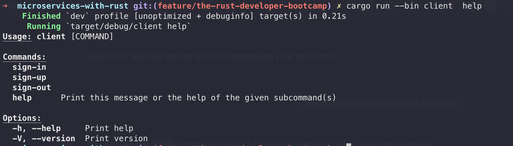

# Microservices with Rust

This project demonstrates how to build microservices using Rust. It includes three main components: `auth`, `health-check`, and `client`.

## Components

- [**auth**](./src/auth-service/): Handles authentication and authorization.
  - The auth service will have three primary features:
    1. Sign in
    2. Sign up
    3. Sign out
- [**health-check**](./src/health-check-service/): Provides health check endpoints for monitoring the services.
- [**client**](./src/client/): A CLI application which acts as a client to interact with the other microservices.

## Running the Services

To run the services, use the following commands:

```bash
cargo run -q --bin auth
cargo run -q --bin health-check
cargo run -q --bin client
```

Alternatively, you can build the project and use `cargo watch` to automatically run the services when changes are detected:

```bash
cargo build

cargo watch -c -q -w src/auth-service -x "run -q --bin auth"
cargo watch -c -q -w src/health-check-service -x "run -q --bin health-check"
```

Each command will start a different microservice.

## Running with Docker

To run the services with Docker using `docker-compose.yaml`, follow these steps:

```bash
docker-compose up
```

## Usages

Using client CLI to interact with the auth service.



Here are some example commands to interact with the auth service using the client CLI:

### Sign Up

To create a new user account:

```bash
cargo run -q --bin client -- signup --username <your_username> --password <your_password>

# E.g
cargo run -q --bin client -- signup --username test123 --password test123

```

### Sign In

To sign in with an existing user account:

```bash
cargo run -q --bin client -- sign-in --username <your_username> --password <your_password>

# E.g
cargo run -q --bin client -- sign-up --username test123 --password test123
```

### Sign Out

To sign out from the current session:

```bash
cargo run -q --bin client -- sign-out
```
